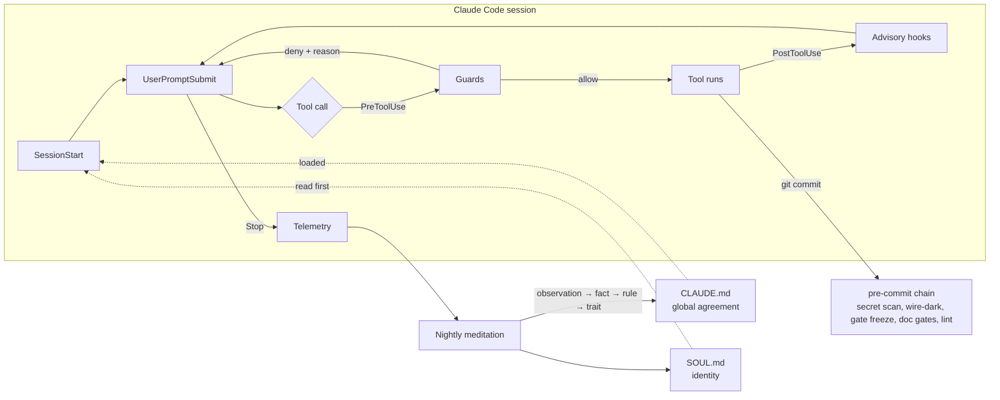
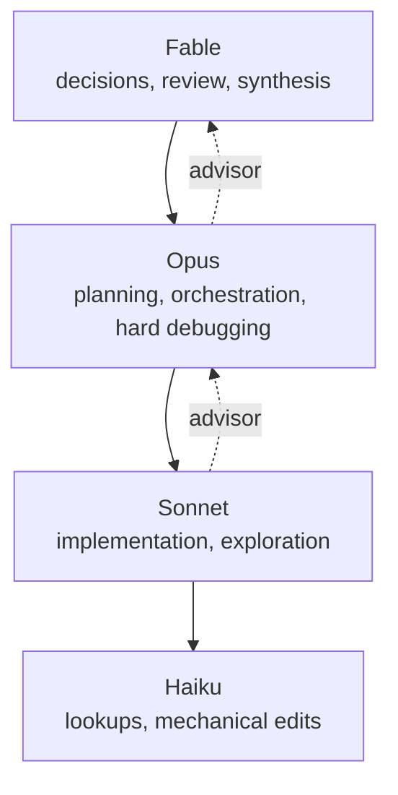

# claude-harness

**The Claude Code setup I run every day, mirrored public.** Incident-born guard
hooks, a model-routing policy that is enforced rather than suggested, a dozen
small zero-dependency tools, and a nightly self-reflection loop that promotes
observations into rules only when the evidence earns it.

Every added mechanism should reduce future supervision enough to justify its
ongoing cost. Automatic context compaction is allowed. Reflection is measured
by better later decisions, and nightly artifact production is optional.

[](LICENSE)
[](docs/windows-gotchas.md)
[](#layout)
[](CHANGELOG.md)
[](https://github.com/sponsors/ucsandman)

This is not a starter kit designed in an afternoon. It grew rule by rule out of
real incidents over six months of daily use, and most of it exists because
something broke first. The private repo that backs it also holds the agent's
memory; that stays on the machine. Everything here was swept file by file
before publishing (see [Security](#security)).

---

## Contents

- [Why it exists](#why-it-exists)
- [How it fits together](#how-it-fits-together)
- [Guards](#guards)
- [Model routing and delegation](#model-routing-and-delegation)
- [Tools](#tools)
- [Scheduled jobs](#scheduled-jobs)
- [Subagents](#subagents)
- [The meditation ladder](#the-meditation-ladder)
- [Layout](#layout)
- [Stealing pieces](#stealing-pieces)
- [What is templated, what is not here](#what-is-templated-what-is-not-here)
- [Security](#security)
- [Contributing, license, support](#contributing-license-support)

---

## Why it exists

Three examples of what "incident-born" means:

- **`hooks/process-kill-guard.cjs`** exists because a subagent cleaned up its
  test window with `Stop-Process -Name notepad` and killed a real Notepad
  session with about 40 tabs of unsaved work. Name-based process kills are now
  blocked at the tool layer. PID-based kills still work.
- **`hooks/agent-model-guard.cjs`** exists because one workflow spawned 110
  agents on the most expensive model through inherited defaults and burned a
  full five-hour usage window. Every agent spawn now requires an explicit
  model, and the expensive tier is capped per session.
- **`git-hooks/pre-commit`** runs `hooks/secret-guard.cjs` over every staged
  file in every repo on the machine, whatever the language, because keys were
  once found sitting in plaintext on disk.
- **The four-round fix session of 2026-09-03** is written up in
  [docs/postmortem-2026-09-03-declick-launch.md](docs/postmortem-2026-09-03-declick-launch.md):
  what a file-scoped fix workflow, a capped advisor, an over-tight edit budget
  and a missing git guard cost on one launch day, and what each became.
- **`hooks/git-tree-guard.cjs`** exists because a reviewer in a 17-agent fix
  workflow ran `git stash` to watch a test fail without its fix, the pop
  conflicted on a sibling's edit, and a 25-file fix pass sat silently reverted
  under six agents still working. Stash, path checkouts, restore, hard reset
  and clean are now denied in shell calls; baselines come from copies
  (`git show HEAD:<path>` into a scratch dir). `workflows/fix-findings.js`
  says the same thing in every prompt it sends.
- **`tools/wiredark`, `hooks/gate-freeze.cjs` and `hooks/slopsquat-guard.cjs`**
  were ported on 2026-09-06 from the postmortem archive of an abandoned agent
  harness (DITlieD/ELAI-archive). The first blocks a commit that adds an export
  nobody calls, because a unit test calling the function directly is
  indistinguishable from a missing caller and prose only lowers the rate. The
  second hashes every guard file and stops a project session from editing the
  evaluator that judges it. The third looks a package name up on its registry
  before an install runs, because a name from training memory is a guess and
  a guessed name is how a typo-squat gets in. The rest of that archive stayed
  where it was; its own postmortem names subsystem-per-problem accretion as
  what killed it.

The design stance behind all of it: a rule written in prose is a hope. A rule
that matters gets a hook, the hook gets a probe that makes it fail on purpose,
and the probe runs on a schedule. A guard that has never been observed failing
has been installed, not verified.

## How it fits together



Two layers do the work. **Hooks** sit on Claude Code's lifecycle events and
either deny a call with a reason the model can act on, or inject context the
model would otherwise forget. **The ladder** runs once a night, reads the
telemetry and the day's work, and decides whether anything earned promotion
into a standing rule. Everything else in the repo is tooling in service of
those two.

## Guards

Every guard is a single file, no dependencies, wired in `settings.json`. Each
carries an override marker so a deliberate exception is one comment away and
gets logged, rather than a reason to switch the guard off.

| Hook | Event | What it does | Override |
|---|---|---|---|
| `secret-guard.cjs` | PreToolUse, pre-commit | Scans tool inputs and every staged file for key shapes, `key=value` secrets and env files. Placeholder-aware. | none |
| `output-secret-watch.cjs` | MessageDisplay | The only output-side guard: watches what the model prints for the same shapes. | none |
| `process-kill-guard.cjs` | PreToolUse | Denies name-based process termination (`Stop-Process -Name`, `taskkill /IM`, `pkill`, `killall`) and dynamic invocations carrying `-Name`. PID forms pass. | `KILL_BY_NAME_OK` |
| `agent-model-guard.cjs` | PreToolUse | Every Agent, Task or Workflow spawn must name its model. Caps top-tier spawns per session. In Workflow scripts the top tier may only appear as a top-level synthesizer after the fan-out. | `AGENT_GUARD_FABLE_CAP` |
| `capability-graph-guard.cjs` | PreToolUse, SubagentStart/Stop | Models delegate downward only (Fable → Opus → Sonnet → Haiku). Peers are not edges. The `advisor` agent is always placed one rung above its caller. | `CAPABILITY_GRAPH_GUARD=off` |
| `fable-delegate-guard.cjs` | PreToolUse, SessionStart, UserPromptSubmit | When the main loop runs on the top model, budgets its direct edits and denies shell code-writing, so implementation goes to cheaper subagents. Decisions, review and synthesis stay. | `# FABLE_OK: <why>` |
| `batch-guard.cjs` | PreToolUse | Denies the fourth consecutive single-statement shell call or single Read/Glob/Grep. Profiling showed one call per turn was the largest single cost. | `# SEQ: <dependency>` |
| `slow-command-guard.cjs` | PreToolUse | Denies backgrounded finite test runs and recursive grep/find rooted at a projects dir, home or a drive. Both hang sessions. | `BG_TEST_OK`, `SLOW_OK` |
| `git-tree-guard.cjs` | PreToolUse | Denies `git stash`, `checkout`/`restore` of paths, `reset --hard`, `clean` in shell calls: a working tree that several agents edit is read-only to git. Reads, branches and commits pass. Prose mentioning the words is not a hit. | `# GIT_TREE_OK: <why>` |
| `gate-freeze.cjs` | PreToolUse | Denies a write to any frozen guard file (`tools/gates/gate-manifest.json`: hooks, pre-commit, the gates runner, the hooks key of `settings.json`) when the session's cwd is outside a harness root, and denies the relock. `gates.cjs gate-freeze` fails on hash drift at session start and in the harness pre-commit; relock deliberately with `gates.cjs --lock`. | `# GATE_OK: <why>`, `GATE_FREEZE=off` |
| `slopsquat-guard.cjs` | PreToolUse | Looks every package named in an npm/pnpm/yarn/bun/npx, pip/uv/poetry/pipx or cargo install up on its registry first. NOT FOUND, STALE (no publish in 24 months), BRAND NEW (under 14 days) and UNVERIFIED deny, with the lookup URL in the reason. Verdicts cache 7 days. | `# PKG_OK: <why>`, `SLOPSQUAT_GUARD=off` |
| `dev-server-guard.cjs` | PreToolUse, PostToolUse | Denies dev servers piped through `head`/`tail` or backgrounded without an explicit opt-in; reminds that stopping a wrapper on Windows leaves the children alive. | `DEV_SERVER_BG_OK` |
| `scope-lock.cjs` | PreToolUse, UserPromptSubmit | Confines Edit/Write to a directory for the session. Arm with `scope-lock <dir>` as a prompt. | `scope-unlock` |
| `repeat-tool-guard.cjs` | PostToolUse | Counts identical consecutive calls and escalates a reminder at 3, 5 and 8. Advisory, never blocks. | `REPEAT_GUARD_OFF=1` |
| `context-nudge.py` | UserPromptSubmit | One nudge per high-context crossing to consider `/compact` or `/clear`. | none |
| `opus-handoff-inject.cjs` | SessionStart, UserPromptSubmit | Detects an Opus session and injects the lower-cost operating notes once. | none |
| `creds-resolve.cjs` | SessionStart | Fills `.env` from a local vault when `.env.example` exists, so the agent never asks for a key it already has. | none |
| `session-count.py` | SessionStart | Warns when several sessions share one rate limit. | none |
| `guard-canary.ps1` | SessionStart, ~20h | Makes each guard fail on purpose and confirms it blocks. | none |
| `correction-tracker.ps1` | UserPromptSubmit | Buckets user corrections so a repeated one surfaces as a rule candidate instead of waiting for a human to notice. | none |
| `skill-telemetry.py` | Stop | One JSONL record per turn: skills, agents, MCP servers, tools, tokens. The ladder's data layer. | none |
| `lsp-reaper.ps1` | scheduled | Kills orphaned TypeScript language servers (once found 663 of them holding 13.6 GB). | none |
| `agent-reaper.ps1` | scheduled, 10 min | Kills orphaned agent processes (a `claude.exe` whose parent died, the MCP servers and `npx -y` launchers it left behind, with their descendants) and headless `claude -p` runs older than 12h. Logs, never kills, when the live session count passes 24: that block belongs to `agent-model-guard`. `-DryRun` prints the victims. | none |

`hooks/tests/` holds the probes. `hooks/adapters/` wires the same files into
Codex and Antigravity so there is one guard suite, not three copies
([docs/harness-parity.md](docs/harness-parity.md)). Mechanism and incident
history for each guard: [docs/harness-guards.md](docs/harness-guards.md).

## Model routing and delegation

The global agreement routes work by cost and the hooks enforce it.



- **Downward only.** A spawn that crosses a missing edge is denied. A fork
  inherits its caller's model, so it counts as a peer edge from any subagent.
- **Upward is consultation, not delegation.** A worker that hits an
  architecture choice, a security boundary, or a second failed fix spawns
  `agents/advisor.md`. The guard ignores any model it asks for and places it
  one rung up. Guidance comes back; ownership stays with the caller.
- **The economics are measured, not assumed.** A subagent costs roughly 60k
  input tokens before its first tool call, then 2-4k per call. Under ten calls
  or eighty edited lines, doing it inline is cheaper on any model. The numbers
  and the method are in
  [tools/tokflow/AUDIT-2026-09-02.md](tools/tokflow/AUDIT-2026-09-02.md).
- **Lean agent types by default.** `haiku-scout`, `sonnet-implementer` and
  `opus-owner` carry restricted tool sets and cost about a third of a
  general-purpose spawn.

## Tools

Zero-dependency, one directory each, each with its own README.

| Tool | What it does |
|---|---|
| [`gates`](tools/gates/) | Mechanical checks over the harness's own docs, hooks and skills: link rot, hook wiring, declared-vs-actual counts, and the guard-file freeze (`gate-freeze`, `--lock`). Runs `--staged` in pre-commit. |
| [`wiredark`](tools/wiredark/) | A new export with no production caller blocks the commit, in every repo. `// WIRE-DARK[<why>]` registers a deliberate dark export. |
| [`prove`](tools/prove/) | Automates "a check never observed failing has been run, not verified": breaks the watched thing, confirms red, restores, confirms green. |
| [`spend`](tools/spend/) | Token and dollar ledger from local transcripts, per session and per day, plus a burn-rate forecast: the 5-hour and 7-day rate-limit windows, trailing pace, and time to a weekly cap you pass in. |
| [`tokflow`](tools/tokflow/) | Transcript miner behind the token audit: where the fixed cost per turn actually goes. |
| [`recall`](tools/recall/) | One search across every institutional-memory store on the machine. |
| [`skillfind`](tools/skillfind/) | Finds any skill on the machine, including the ones no session can see. |
| [`fleet`](tools/fleet/) | Live board of running Claude Code sessions. |
| [`gitradar`](tools/gitradar/) | Status board of every git repo on the machine: dirty trees, unpushed commits, stale branches. |
| [`cronwatch`](tools/cronwatch/) | Health board for Windows Task Scheduler jobs: last run, last result, next due. |
| [`envdoctor`](tools/envdoctor/) | Read-only checkup of secrets wiring. Reports names and locations, never values. |
| [`procledger`](tools/procledger/) | Every process an agent starts gets a PID entry; cleanup is by PID, never by name. |
| [`errorlog`](tools/errorlog/) | Two daily error logs: one harvests itself from transcripts, one you type into. |
| [`deskclaw`](tools/deskclaw/) | Read-only eye on the Windows desktop for native apps and dialogs; a hand only when a human arms it. Redacts before anything reaches a transcript. |
| [`ears`](tools/ears/) | Hears any audio or video file and returns a transcript. |
| [`mouth`](tools/mouth/) | Minimal Windows text-to-speech so a long job can say it finished. |
| [`harness-sync`](tools/harness-sync/) | Generates `AGENTS.md` and `GEMINI.md` from `CLAUDE.md` and reports parity across the three harnesses. |

## Scheduled jobs

| Job | Cadence | What it does |
|---|---|---|
| [`meditation`](scripts/meditation/) | nightly | The reflection loop. See [the ladder](#the-meditation-ladder). |
| [`fleet-briefing`](scripts/fleet-briefing/) | daily, 7am | Collects overnight deploys, CI, revenue and error-tracker issues into one HTML board and emails it. |
| [`errorlog`](scripts/errorlog/) | daily, before meditation | Harvests errors out of the day's transcripts so the meditation session can read them. |
| [`harness-audit`](scripts/harness-audit/) | weekly | A headless agent reads the harness itself in an isolated worktree and reports drift: registered hooks that do not dispatch, docs that lie, counts that are wrong. |
| [`deploy-sentinel`](scripts/deploy-sentinel/) | every 30 min | Polls deploy states and CI, opens an incident exactly once per new failure. |
| [`costclaw-watchdog`](scripts/costclaw-watchdog/) | nightly | Diffs cumulative spend against last night, alerts on the incident shapes that once cost a real bill, renders a 30-night trend. |
| [`launch-board`](scripts/launch-board/) | on demand | Local web console: per-project launch readiness with re-check buttons. |
| `harness-health.ps1` | on demand | Read-only check of hooks, MCP servers and plugins after any settings change. |

## Subagents

| Agent | Model | Role |
|---|---|---|
| [`haiku-scout`](agents/haiku-scout.md) | Haiku | Mechanical lookups: file searches, symbol hunting, inventory tables, git history. |
| [`sonnet-implementer`](agents/sonnet-implementer.md) | Sonnet | Feature slices and refactors within a defined scope. Given files, acceptance criteria and a verify command. |
| [`opus-owner`](agents/opus-owner.md) | Opus | A large or risky task the main loop has scoped. May delegate downward. |
| [`advisor`](agents/advisor.md) | one rung above the caller | One focused decision. Read-only, guidance only, never capped: a blocked consultation becomes a guess, and a guess costs more than the advice. |
| [`security-reviewer`](agents/security-reviewer.md) | Opus | Read-only review of anything touching auth, billing, secrets, webhooks or database access. Findings only, never edits. |
| [`e2e-verifier`](agents/e2e-verifier.md) | Sonnet | Runs the verify command or the route walk for a change someone else made, from a context that did not write it. Reports a verdict with counts, one line per criterion, and which check it made fail on purpose. Never edits. |

## The meditation ladder

The part people ask about most. A scheduled session runs every morning,
reflects on recent work, and appends dated observations. Ideas climb a ladder:

```
observation  →  fact (memory)  →  rule (CLAUDE.md)  →  trait (SOUL.md)
```

Each rung has explicit graduation gates. A rule needs three or more signals
across two or more distinct sessions, with signals older than thirty days
counting half. Every promotion cites the dated evidence that earned it. The
ladder runs both ways: one contradiction is recorded, two demote. Failure
lessons are written as evidence ("when X broke, Y fixed it"), not commands, so
a hostile input cannot become a standing rule in one session.

The design goal is that refusing a promotion is the normal outcome. A gate that
has never once refused anything is not a gate. The gates, the demotion path
and the write rails for `SOUL.md` are in
[meditations/MEDITATIONS.md](meditations/MEDITATIONS.md).

## Layout

| Path | What it is |
|---|---|
| `CLAUDE.md` | The global working agreement, loaded into every session. Generated from a single source so Claude Code, Codex and Antigravity read the same text. |
| `SOUL.md` | Who the agent is. Read before `CLAUDE.md`. **Template here**, see below. |
| `RTK.md` | Notes for rtk, a Rust CLI proxy that compresses shell output 60 to 90 percent via a hook. |
| `settings.json` | Hook wiring, permissions, env. Secrets live in a separate untracked file it points at. |
| `hooks/` | The guards above, their probes under `tests/`, and the Codex and Antigravity adapters. |
| `git-hooks/` | The global pre-commit chain (`core.hooksPath`): secret scan, staged doc gates, Python lint and dead-code gate. |
| `tools/` | The tools above. |
| `scripts/` | The scheduled jobs above. |
| `agents/` | The subagent definitions above. |
| `docs/` | Reference docs `CLAUDE.md` points at, plus [`reddit-claude-setup-share.md`](docs/reddit-claude-setup-share.md), a guided tour written to be pasted into Claude Code and adapted to your project. |
| `meditations/` | The nightly loop and the promotion ladder. **Templates here**, see below. |

## Stealing pieces

Do not clone this expecting a turnkey install. Paths are Windows and specific
to one machine. The useful move is taking one piece at a time.

**Where the paths live.** The hooks find their siblings with `__dirname` and
the user's home with `os.homedir()` / `$env:USERPROFILE`, so a copied guard
runs from wherever you put it. The absolute paths are in three places only:
`settings.json` (the hook commands), the `*-launcher.vbs` files next to the
scheduled scripts, and the scheduled-task registrations themselves. Search
those for the home directory and replace it; nothing else is pinned.

**One guard.** Copy the file, then register it. A PreToolUse hook that prints a
deny reason to stderr and exits 2 blocks the call and hands the model the
reason:

```json
{
  "hooks": {
    "PreToolUse": [
      {
        "matcher": "Bash|PowerShell",
        "hooks": [
          { "type": "command", "command": "node \"C:/path/to/hooks/process-kill-guard.cjs\"" }
        ]
      }
    ]
  }
}
```

**The pre-commit chain.** Point git at the directory once and every repo on
the machine gets the secret scan:

```bash
git config --global core.hooksPath /path/to/git-hooks
```

**The ladder.** `meditations/MEDITATIONS.md` is self-contained. Start with an
empty `CANDIDATES.md`, run the nightly prompt in `scripts/meditation/`, and
refuse the first few promotions on purpose to see the gates work.

[`docs/reddit-claude-setup-share.md`](docs/reddit-claude-setup-share.md) walks
the whole setup with a "steal this pattern" line per item.

## What is templated, what is not here

`SOUL.md` and everything under `meditations/` are structural templates in this
mirror. The real files accumulate personal and business context that stays
private. The mechanism, the gates and the write rails are here unchanged.

Not in the mirror:

- `projects/`, the agent's memory store.
- `skills/`, personal skill definitions, some of them voice and identity
  material.
- The profile block of the private `CLAUDE.md` (memory wiring, project map, a
  remote devbox) and the `autoMode` trust-boundary block of `settings.json`.
  Both map my machines and business context.
- `.secrets.env` and anything else untracked.
- The scheduled jobs that drive product repos and the autonomous company that
  runs on top of this harness. Different repos, private.

## Security

The private repo never contained credentials. Before each sync this mirror is
swept file by file for key shapes, bearer tokens, credentialed URLs,
`key=value` secrets, emails and phone numbers, and the sweep prints the file
count beside its verdict so a clean result on zero files cannot pass as clean.
The last sync scanned 187 files; the only hits were fake keys inside
`tools/deskclaw/tests/`, which exist to prove the redaction works.

If you find something that should not be here, see [SECURITY.md](SECURITY.md).

## Contributing, license, support

Issues and pull requests are welcome, especially incident reports of the form
"this guard let X through" with a probe that reproduces it. See
[CONTRIBUTING.md](CONTRIBUTING.md). Changes to the mirror are listed in
[CHANGELOG.md](CHANGELOG.md).

MIT. If these tools save you time:

[](https://github.com/sponsors/ucsandman)
[](https://buymeacoffee.com/wes_sander)
